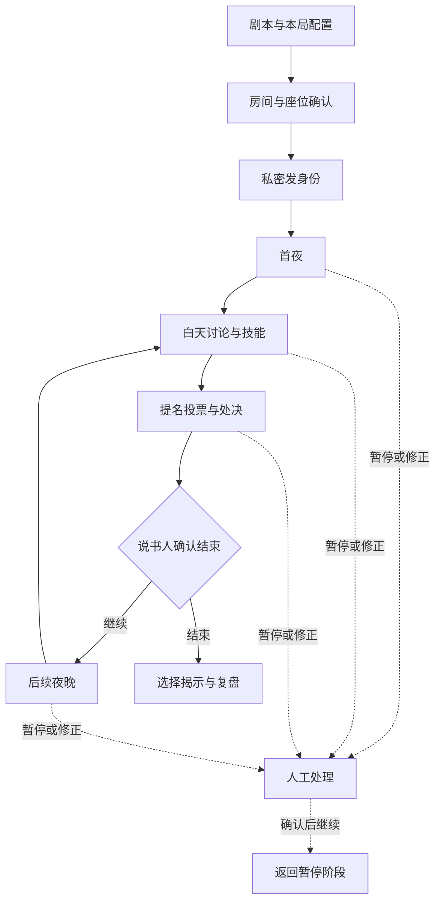

# 《血染钟楼》网页辅助工具：调研与第一版开发计划

版本：v1.0 计划稿  
调研日期：2026 年 9 月 9 日  
目标平台：GitHub Pages 网页；电脑、平板、手机浏览器  
后端约束：需要数据库、认证、实时同步时，统一使用 Supabase

**建议建设一个中文的多人开局与说书人辅助网站：选剧本、自由增减角色、配置本局身份、私密发身份、管理魔典、引导夜晚、记录提名投票、保存对局和复盘。第一版以真人说书人主持为核心，支持线下聚会，也能配合已有语音工具用于线上聚会。**

这里“让 AI 帮忙开发”和“网站运行时接入 AI”是两件事。上述第一版可以由 Codex 辅助开发，运行时不需要接入大模型。

---

## 1. 已确认的需求与本计划的默认取舍

| 用户需求 | 对应产品能力 | 第一版落实方式 |
| --- | --- | --- |
| 0. 选版型，可以自由添加或者减少角色 | 剧本库、剧本编辑、本局配板 | 内置基础剧本；复制后增删角色；支持自定义角色与 JSON 导入；本局实际身份单独配置 |
| 1. 发身份 | 房间、座位、私密身份卡 | 玩家用手机进房，确认座位后领取身份；说书人能查看领取情况；支持指定分配与随机分配 |
| 2. 裁判／说书人记录 | 私密魔典、夜序、标记、日志 | 记录真实角色、阵营、状态、技能目标、发出的信息、死亡、处决和投票 |
| 3. 全面调查功能与流程 | 竞品对照、完整流程、需求优先级 | 本文给出已核实的代表实现、功能全集、分期范围和验收标准 |
| 需要数据库时使用 Supabase | 云端持久化、访问控制、多人同步 | Supabase Postgres、Auth、Realtime、Edge Functions；文件上传按需使用 Storage |
| 在 GitHub 部署 | 源码管理与网页托管 | GitHub 仓库管理代码，GitHub Actions 构建，GitHub Pages 托管前端 |

默认取舍：

- 中文优先；角色保留稳定英文 ID，名称可按语言显示。
- 说书人以平板和电脑为主要工作设备，手机也能操作；玩家手机端优先。
- 第一版支持 5–15 名普通玩家，并提供旅行者的基础记录与放逐入口，界面容量按最多 20 名玩家规划。5–6 人局采用单独的开局提示。
- 先完成熟人进房、私密发身份和真人主持。完整语音、视频、公开匹配、社区运营放在扩展阶段。
- 自由组板和自创角色都允许。网站提供结构校验、资料提示与手动处理入口，不承诺任意剧本的平衡性或全部技能的自动结算。
- 先使用独立房间和单个主说书人写入；协同说书人的同时编辑后续增加。

### 公开部署前的实际约束

TPI 当前的社区内容政策允许个人用途创作，但明确限制分发与官方 App 或剧本工具竞争的工具，并说明其他项目获批不构成普遍先例。因此，本项目的**公开发行范围及素材使用，需要在上线前取得适用于本项目的明确结论**；免费、开源或仅给熟人使用，不能直接当作已获许可。[S01]

这不影响本次完成调研和设计。技术方案保留你的完整需求，发布阶段单列授权核实。角色数据、图标、中文译文和参考项目代码分别记录来源与使用条件，不把代码许可证当作所有游戏素材的许可证。[S02]

GitHub 仓库私有，也不意味着普通 GitHub Pages 网站私有。房间访问控制还须由应用和 Supabase 实现。[S03][S04]

---

## 2. 调研范围和证据强度

本次检索覆盖英文与中文生态：官方在线工具、官方剧本工具、开源联机魔典、移动魔典、中文说书人工具、剧本检查与检索、对局记录，以及 GitHub Pages 和 Supabase 的官方文档。

**不能保证穷尽全网所有实现。** 已找到的旧站、分支和小型项目很多，也有登录后或原生 App 内的功能无法直接验证。以下将“从界面核实”“从项目文档核实”和“只作为检索线索”区分开，避免把项目自述写成完整实测结论。

证据标记：

- **U：界面核实。** 实际浏览公开页面、查看控件或操作局部流程。
- **D：一手文档核实。** 项目自己的 README、功能说明、官方资源或开发者应用商店说明。
- **L：线索。** 搜索摘要或工具目录发现；不足以证明当前全套功能正常运行。
- 本次未对任何第三方工具完成整局多人实测，也未做完整源码安全审计。

### 2.1 主要对照对象

| 实现 | 定位 | 核实到的能力 | 对本项目的启示 | 证据与限制 |
| --- | --- | --- | --- | --- |
| 官方 Blood on the Clocktower Online／botc.app | 官方线上游戏工具 | 自定义／Homebrew 数据、特殊发身份规则、夜间信息卡、魔典信息投送、特殊票权和秘密投票等扩展接口 | 秘密信息、角色显示与真实状态必须分别建模 | U+D；查看登录页和官方资源文档，未进入付费或登录房间 [S05][S06] |
| 官方 Script Tool | 剧本编辑 | 按角色类型、版本筛选，搜索角色，编辑剧本名称和作者，随机、导入、导出、自动排序、撤销／重做入口 | 剧本编辑要独立于实际开局配板；兼容官方 JSON | U+D；查看编辑界面及导出入口，未逐项验证所有导出格式 [S07] |
| Pocket Grimoire | 手机／平板线下魔典 | 三大基础剧本、JSON／URL／粘贴导入、人数配比表、角色勾选、允许重复角色、随机选角、抽身份、二维码角色表、夜序、信息标记和说书人笔记 | 参考移动布局、开局向导、递手机抽身份和遮挡模式 | U+D；实际选择 TB 并进入角色选择页；抽身份和后续流程由文档核实 [S08][S09] |
| bra1n/townsquare／clocktower.online | 经典开源联机魔典 | 公共城镇与说书人魔典、身份分发、实时投票、夜序、基础剧本、自定义剧本及 Homebrew | 参考公共／私密两种视图及房间交互 | D；README 明确不再积极维护，仅处理关键问题；代码标为 GPL-3.0 [S10] |
| brennenho/botc | 使用 Supabase 的共享魔典 | 房间码加入、私人身份展示、生命／阵营／标记／恶魔伪装、昼夜与夜序、响应式布局；README 明确本地 Supabase 流程 | 与本项目的数据库要求接近，可参考领域模型和多人流程 | D；仓库为 MIT；package.json 使用 Next.js 与 Supabase，不能据此假定原样可在 Pages 运行 [S11][S12] |
| Olalall 的 AI 说书人辅助项目 | 中文线下说书人工作台 | 配板、身份交接、夜序、白天投票、计时、日志、复盘、移动端遮挡；项目声明可离线使用部分功能 | 吸收记录、更正、夜晚工作台和收尾流程；AI 能力可选 | D；属于维护者自述，未运行其安装包或验证角色结算 [S13] |
| BOTC Script Checker | 剧本检查 | 读取剧本 JSON，提示可能存在的搭配问题；作者明确提醒不代表每条警告都必须消除 | 校验分成结构错误、规则提醒、搭配建议，避免强制“修正”合理的自定义剧本 | D；已查看页面说明 [S14] |
| ClockTracker | 对局履历与复盘 | 角色、剧本、结果记录，统计，笔记、图片、完整魔典记录，朋友与社区 | 对局完成后可保存记录；公共复盘与私人笔记分别控制 | D；查看公开首页，未登录验证记录流程 [S15] |
| 中文《血染钟楼》App | 移动组局与社交 | 开发者说明包含组局、私密／公开房、夜间辅助、技能提醒、投票统计、DIY、战绩和社交 | 说明组局、主持、记录是中文市场的常见功能组合；社交不是本项目首发必需 | D；依据开发者在 App Store 的公开说明；授权身份也属于页面自述 [S16] |
| BotC Scripts | 社区剧本发现 | 搜索、剧本类型和单恶魔过滤等入口 | 第一版支持导入已有文件即可；远端库集成不应成为开局依赖 | L；检索到官方站点摘要，正文访问失败，未验证下载与 API [S17] |

### 2.2 补充检索到的实现与线索

| 项目／站点 | 可继续参考的方向 | 本次处理 |
| --- | --- | --- |
| clocktower.live、clocktower.tf、grimlive 等 Townsquare 分支 | 不同语言、聊天和记录扩展 | 社区工具目录和仓库线索；不假定分支拥有原站全部功能 [S18][S19] |
| botcgrimoire.top、bloodclocktower.online、斗鱼旧魔典 | 中文魔典、私聊、中文剧本适配 | 发现公开入口；部分超时或缺少可提取正文，未纳入已实测范围 [S20][S21][S22] |
| tchajed/botc-tools | 线下开局、说书人角色表 | 仓库检索线索，未完整核实当前运行状态 [S23] |
| TPA2001/blood-on-the-clocktower-grimoire | Android 电子魔典 | 原生项目参考；不能作为可直接部署的网页项目 [S24] |
| Digital Grimoire、Grimmy、Grim-Sim、The Grim | 移动魔典、撤销、逐步夜序、玩家笔记 | 通过工具目录发现；不把目录描述当成当前功能保证 [S18] |
| Bloodstar Clocktica、Ravenswood Studio 等 | 自制角色、图标、剧本排版 | 作为内容编辑方向参考；高级排版不进入首版主线 [S18] |
| 钟楼博物馆及中文 Wiki | 中文剧本、DIY 角色与术语 | 作为用户导入和内容来源线索；不批量搬运其素材 [S25] |

### 2.3 从调研得出的产品判断

以下是本项目的设计判断：

1. 现有实现大致覆盖三段工作：开局配置、局中主持、赛后记录。你的需求应把三段接起来。
2. 功能清单里最容易漏掉的是秘密信息、异常恢复、手动改判和中途角色变化。这些比首页样式更影响真实开局。
3. 现成项目适合参考流程。是否直接 Fork，需要另外验证许可证、数据权限、维护状态及 Pages 适配成本。
4. 在“GitHub Pages + Supabase”的约束下，新建结构清晰的前端和后端数据层更可控。brennenho/botc 可作为优先源码参考，传统 Townsquare 可作为交互参考。
5. 中文、手机易用、私密发身份、说书人记录连贯，是首版最值得完成的价值。公开大厅、语音房和复杂社区会显著扩大工程范围。

---

## 3. 必须先说清楚的游戏概念

### 3.1 剧本角色池、本局配置、发给玩家的身份，分别管理

| 对象 | 含义 | 谁可见 | 举例 |
| --- | --- | --- | --- |
| 剧本角色池 | 本局可能出现的角色清单 | 本房间玩家 | 剧本列出多个镇民和恶魔，不表示全部在场 |
| 本局真实配置 | 说书人实际选入的角色及其状态 | 说书人 | 从角色池选择符合人数和玩法的一组角色 |
| 玩家获知身份 | 玩家被告知或抽到的身份 | 该玩家与说书人 | 真实是酒鬼，看到的可能是调查员 |
| 恶魔伪装 | 由说书人选定、按规则告知的伪装角色 | 获准知情的玩家 | 不属于“实际在场角色清单” |
| 全局规则角色 | Fabled、Loric 等规则与配置 | 根据玩法公开 | 不占普通玩家身份槽位 |

官方开局资料区分先选剧本，再秘密选择入场角色，再进行设置修正和抽取；酒鬼条目说明其真实角色与抽到的镇民身份不同。[S26][S27]

因此，用户在“角色池”里删除一个角色，不应悄悄改写已经开始的对局。开局使用剧本与角色资料的固定版本；中途改角色走独立的说书人操作并留记录。

### 3.2 不能混为一个字段的状态

| 信息 | 应如何处理 |
| --- | --- |
| 真实角色／玩家获知角色 | 分开存储；玩家只收到应该知道的版本 |
| 真实阵营／玩家获知阵营 | 分开存储并支持变化；不能根据角色类别直接推定当前阵营 |
| 生死／对外公布的生死 | 分开处理；夜间死亡在说书人宣布之前，不同步公开 |
| 处决／死亡 | 记录为不同事件；有些处决不导致死亡，死者也可能被处决 |
| 技能是否尝试／是否生效 | 分开记录；醉酒或中毒时仍可能需要正常叫醒、选择和反馈 |
| 醉酒／中毒 | 可并存，各自有来源和持续时间，不能只用一个互斥下拉框 |
| 剩余技能次数／技能目标／标记 | 独立保存，避免改角色时误删仍然相关的状态 |
| 玩家推理笔记／官方局面事实 | 完全分开，玩家的猜测不能改动真实魔典 |

这些状态分离来自官方 States、Drunk 和规则说明；具体数据库划分是本计划的设计。[S27][S28][S29]

### 3.3 第一版的规则处理原则

- 网站负责保存事实、显示资料、提醒流程、协助计数。
- 说书人负责决定能力是否生效、给出什么信息、何时公开结果和何时结束游戏。
- 已知结构错误可以阻止保存，例如身份槽位缺失、座位重复、非法 JSON。
- 人数配比变化、重复角色、相克搭配、特殊胜负等，按具体角色和模式提醒，允许说书人明确接管。
- 对未知角色，展示原始能力、夜序和自定义标记，支持完整手动记录；不能“假装已经自动支持”。

---

## 4. 完整使用流程

### 4.1 说书人的一次完整对局

| 步骤 | 说书人操作 | 网站提供 | 关键检查 |
| --- | --- | --- | --- |
| 1. 选择模式 | 线下辅助或外部语音线上局 | 创建房间、基础设置 | 说明本局使用的交流方式 |
| 2. 选剧本 | 选择基础剧本、导入文件或复制已有剧本 | 角色搜索、分类、资料 | 剧本角色池不公开实际配板 |
| 3. 修改角色池 | 增加、删除角色，必要时添加自制角色 | 草稿、校验、保存版本 | 角色 ID、必填字段、夜序完整 |
| 4. 设置人数与座位 | 填入玩家数、编号、昵称，安排旅行者 | 座位环与名单，房间链接／二维码 | 一名普通玩家对应一个身份槽位 |
| 5. 配置本局身份 | 手动选角或随机生成候选，设置真实／展示身份、标记和伪装 | 人数配比提示、设置修正提醒 | 酒鬼等不能直接向玩家暴露真实身份 |
| 6. 玩家入房 | 确认申请，绑定座位，锁定名单 | 临时玩家身份、待确认名单 | 防止抢占座位和重复入座 |
| 7. 发身份 | 确认分配并发送 | 私密身份卡、已查看／未查看状态 | 刷新不重抽；重发不重新随机 |
| 8. 首夜 | 按夜序逐项处理，进行首夜信息发送 | 唤醒清单、信息卡、目标选择、已处理状态 | 不向公共视图暴露叫醒谁或发了什么 |
| 9. 白天 | 宣布结果，公聊，处理白天技能 | 公共城镇、计时、私密技能记录 | 白天技能与普通提名分别记录 |
| 10. 提名与投票 | 开启提名，依序记录票型，确认处决 | 提名历史、票数门槛、平票与待处决提示 | 区分举手、计入的票和说书人最终裁定 |
| 11. 后续夜晚 | 处理状态到期、技能与信息 | 其他夜夜序、死亡触发任务、遗漏提醒 | 不能简单跳过所有死者或醉毒玩家 |
| 12. 结束与复盘 | 确认胜负，选择揭示内容，保存 | 时间线、最终魔典、导出、再开一局 | 玩家私人笔记不会自动公开 |

### 4.2 玩家流程

1. 打开链接／扫描二维码，输入昵称。
2. 等待说书人确认并绑定座位。
3. 主动点击查看自己的身份；看完可盖回。
4. 浏览公开剧本和角色能力，记录自己的推理。
5. 夜晚按说书人提示提交选择、查看个人信息卡。
6. 白天查看公开生死、票型、计时和提名结果；线上自行举手投票作为下一阶段增强。
7. 掉线后在原浏览器重进恢复自己的座位和信息。
8. 结束后查看说书人选择公开的复盘。

更换设备或清空浏览器数据时，匿名用户不能自动证明自己就是原来的玩家，需要由说书人确认并重新绑定；不能靠“同名”认领身份。[S30]

### 4.3 对局状态与人工接管

图示为常规流程。特殊技能可以插入处决、死亡、角色变化和终局检查，不要求所有剧本严格按固定按钮顺序执行。

---

## 5. 功能全集与优先级

**P0：第一版可真实使用所必需。P1：首次真实开局后增强。P2：需求验证后选做。**

### 5.1 剧本与角色编辑

| ID | 功能 | 优先级 | 要求 |
| --- | --- | --- | --- |
| A01 | 三大基础剧本 | P0 | 暗流涌动 TB、黯月初升 BMR、梦殒春宵 S&V；内容来源与版本可追踪 |
| A02 | 复制剧本后自由增删角色 | P0 | 保留原剧本；草稿保存；角色可跨基础版本加入 |
| A03 | 角色搜索与分类 | P0 | 中文名、英文名；镇民／外来者／爪牙／恶魔／旅行者等分类 |
| A04 | 新建自定义角色 | P0 | 名称、类别、能力、首夜／其他夜夜序、提醒标记；图标缺省时使用通用样式 |
| A05 | JSON 导入、粘贴和导出 | P0 | 兼容官方角色 ID、对象形式和 _meta；错误定位到具体条目 |
| A06 | 相克和设置变动提示 | P0 | 展示已知相克、设置修正；缺少说明的角色标记为手动处理 |
| A07 | 剧本与角色资料版本 | P0 | 每局冻结快照；资料更新不影响正在进行的游戏 |
| A08 | 公开角色表 | P0 | 玩家能查看本局候选角色与技能；不显示哪些实际入场 |
| A09 | 收藏、搜索历史、剧本标签 | P1 | 适合人数、复杂度、作者、适用场景；复杂度允许作者填写 |
| A10 | 打印／PDF／图片分享 | P1 | 优先浏览器打印；高级排版后加 |
| A11 | 远端剧本库搜索与 URL 导入 | P1 | 依赖清晰且允许使用的接口；导入失败时保留文件上传路径 |
| A12 | 自制角色高级编辑和内容包 | P1 | 图标上传、多语言、独立版本；不执行用户提供的 JavaScript |
| A13 | 剧本社区、点赞、公开投稿 | P2 | 增加内容治理和维护成本，另立范围 |

JSON 兼容需要遵循当前官方 Schema。官方类别已包含 loric，不能只按旧魔典的类别枚举设计。未识别角色 ID 应保留原始条目并提示补充资料；角色 ID 冲突和未知扩展字段不能被静默覆盖或丢弃。[S06][S31]

### 5.2 本局配板和发身份

| ID | 功能 | 优先级 | 要求 |
| --- | --- | --- | --- |
| B01 | 基础人数配比提示 | P0 | 普通人数和旅行者分开计；支持角色带来的设置修正 |
| B02 | 手动配板 | P0 | 所选实际身份数量与身份槽位一致 |
| B03 | 随机配板候选 | P0 | 在可用角色内随机选择；说书人检查后确认，不宣称自动平衡 |
| B04 | 随机分配与指定分配 | P0 | 两种操作明确区分；服务端保存唯一分配结果 |
| B05 | 真实身份／展示身份设置 | P0 | 至少完整覆盖酒鬼；可扩展到疯子、提线木偶等 |
| B06 | 恶魔伪装与首夜准备 | P0 | 由说书人确认；不把伪装角色算作入场角色 |
| B07 | 手机领取身份 | P0 | 房间码或二维码进入；领到本人被告知的角色、阵营与能力 |
| B08 | 递手机展示身份 | P0 | 说书人设备一次只展示一张卡，返回时完全遮挡私密魔典 |
| B09 | 查看确认与重发 | P0 | 已查看状态仅说书人可见；重发同一张卡不会重新随机 |
| B10 | 发后修改／重新开局 | P0 | 新事件留痕；提醒信息可能已被看见，不能承诺撤销泄露 |
| B11 | 锁定指定角色、排除角色 | P1 | 用于半随机配板；保存限制条件 |
| B12 | 玩家私密角色偏好 | P2 | 只作为说书人参考，不改变公开随机发牌的含义 |

### 5.3 房间、身份与访问控制

| ID | 功能 | 优先级 | 要求 |
| --- | --- | --- | --- |
| C01 | 创建房间、邀请进房 | P0 | 房间码用于定位房间；加入仍需身份绑定和主说书人确认 |
| C02 | 玩家免填邮箱加入 | P0 | Supabase 匿名登录，得到稳定用户身份 |
| C03 | 主说书人持久账号 | P0 | 默认 GitHub OAuth；玩家不需要 GitHub 账号；邮箱登录可后加 |
| C04 | 座位调整、入座确认 | P0 | 同一座位不能被两人占用；发牌后移动座位不改变身份归属 |
| C05 | 断线重进与换机恢复 | P0 | 同浏览器恢复；换机由说书人确认，撤销旧设备对应授权 |
| C06 | 锁房、移除、暂停、结束 | P0 | 由后端校验权限；离开房间不自动等于游戏死亡 |
| C07 | 说书人、玩家、公开视图隔离 | P0 | 权限在数据层执行，页面隐藏只用于体验 |
| C08 | 协同说书人 | P1 | 邀请及撤销权限；并发冲突处理 |
| C09 | 旁观、投屏、分享复盘 | P1 | 默认只见公开内容；秘密旁观单独授权 |
| C10 | 大厅、预约、公开匹配 | P2 | 需要额外防滥用、举报与运营能力 |

### 5.4 说书人魔典和夜晚工作台

| ID | 功能 | 优先级 | 要求 |
| --- | --- | --- | --- |
| D01 | 座位环与列表双视图 | P0 | 角色、昵称、座位、生命状态清楚；手机可切列表 |
| D02 | 生死、阵营、角色变化 | P0 | 分开修改；夜间真实变化等待说书人公开 |
| D03 | 提醒标记 | P0 | 醉酒、中毒、保护、技能已用、自定义标记；记录来源、目标和持续时间 |
| D04 | 游戏全局信息 | P0 | 当前日夜、恶魔伪装、Fabled／Loric、特殊规则和备注 |
| D05 | 玩家笔记与全局笔记 | P0 | 说书人工作笔记不直接出现在公开日志 |
| D06 | 首夜／其他夜夜序 | P0 | 根据本局和展示身份生成待办；包含规则要求的首夜信息步骤 |
| D07 | 夜间任务处理 | P0 | 待处理、已处理、跳过；记录目标、结果、给予的信息 |
| D08 | 私密信息卡和选择请求 | P0 | 数字、是非、角色、阵营、指定玩家、文字；仅指定收件人可读 |
| D09 | 魔典信息展示 | P0 | 间谍等采用由说书人确认的只读快照；可以编辑应展示内容；不授予全局后台权限 |
| D10 | 死亡触发／临时任务 | P0 | 能插入夜间任务；不会因角色已死而丢失守鸦人等应处理行动 |
| D11 | 夜序调整和手动结算 | P0 | 支持改序、返回、补录；不强制自动跳过醉酒、中毒者 |
| D12 | 一键遮挡与玩家展示模式 | P0 | 私密内容从展示视图排除，不能只靠模糊处理 |
| D13 | 自动提醒状态到期 | P1 | 先提示、后确认；任意自定义持续时间仍可手动管理 |
| D14 | 高级技能专用操作面板 | P1 | 在通用记录稳定后，逐批增强复杂角色 |
| D15 | 角色规则问答／AI 建议 | P2 | 如引入，仅给说书人建议；不得直接向玩家发送未经确认的结论 |

### 5.5 白天、投票、旅行者和复盘

| ID | 功能 | 优先级 | 要求 |
| --- | --- | --- | --- |
| E01 | 白天结果公布 | P0 | 发布明确的公开结果；不泄露夜间操作时间与中毒目标 |
| E02 | 公聊计时 | P0 | 开始、暂停、延长；服务器时间戳作为同步依据 |
| E03 | 提名记录 | P0 | 提名人、被提名人、顺序；普通规则下提醒当日提名限制 |
| E04 | 说书人记票 | P0 | 逐座位记录；线下以举手和说书人确认结果为准 |
| E05 | 票数门槛、平票和待处决 | P0 | 普通规则下显示门槛；特殊规则允许手动接管 |
| E06 | 死者投票权 | P0 | 投票被实际计入后更新；支持说书人纠正 |
| E07 | 处决／死亡分别记录 | P0 | 能记录执行了处决却未死亡、对死者处决等情况 |
| E08 | 旅行者加入、离开、角色和阵营 | P0 | 公开旅行者角色；真实阵营按玩法保密；离开与死亡分开 |
| E09 | 旅行者放逐 | P0 | 独立于普通提名／处决；不消耗死者投票权；先由说书人确认结果 |
| E10 | 特殊投票和白天技能 | P0 | 有手动记录模式；不能把所有剧本强制当普通票型 |
| E11 | 线上举手与依序计票 | P1 | 玩家可以抬手／放手；经过其座位时锁定当次记录；处理掉线与重试 |
| E12 | 秘密投票、票权倍数等专门面板 | P1 | 按角色开启；未支持时使用 P0 私密手动记录 |
| E13 | 确认胜负与结束对局 | P0 | 说书人确认；记录获胜阵营、原因和必要例外 |
| E14 | 自动日志、修正与阶段快照 | P0 | 关键操作保存；能纠正误记；不声称消除已发送的信息 |
| E15 | 对局存档和导出 | P0 | 说书人完整存档与玩家可见复盘分开；导入恢复可在新副本进行 |
| E16 | 玩家私人笔记 | P0 | 自己可读写；不自动提供给说书人、其他玩家或赛后公众 |
| E17 | 历史统计与复盘分享 | P1 | 对局结果、角色、剧本筛选；分享由说书人选择内容 |
| E18 | 逐事件回放、俱乐部管理 | P2 | 基于事件记录扩展 |
| E19 | 内置语音、视频和私聊房 | P2 | 另立媒体方案；Supabase 的数据库和 Realtime 不等于完整语音系统 |
| E20 | 排行榜、积分、商业化 | P2 | 属于独立产品决策，且需重新核实发行和使用条件 |

普通处决投票的基本门槛是达到存活玩家数的一半、向上取整，并比较其他被提名者的票数；平票及特殊角色需要按对应规则处理。死者通常只保留一次投票机会。旅行者放逐独立于普通投票，不能照搬普通投票的扣票、技能触发和处决逻辑。[S29][S32]

---

## 6. 第一版必须正确处理的边界案例

这些是实现验收样例，不是把整本规则转成自动规则引擎。

| 场景 | 预期系统行为 |
| --- | --- |
| 酒鬼认为自己是调查员 | 玩家只得到调查员身份；真实酒鬼仅说书人可见；夜间任务按应展示的身份提示 |
| 酒鬼／中毒玩家需要夜间行动 | 仍可叫醒、选择、发送信息；是否生效由说书人记录 |
| 男爵等影响初始配置 | 配比提示允许设置修正；不把固定基础配比当不可改变的限制 |
| 阵营改变但角色未变 | 只更新阵营；按规则单独发通知 |
| 角色改变但阵营未变 | 不自动把阵营改成新角色的默认阵营 |
| 守鸦人夜间死亡 | 保留或插入其死亡触发行动 |
| 间谍查看魔典 | 发送经确认的只读魔典快照；不暴露说书人的自由笔记、管理功能和全部历史 |
| 僵怖等实际生死与外观不同 | 真实状态与公开状态分别维护 |
| 被处决但未死亡 | 当日处决记录成立；生命状态按裁定维护 |
| 提名死者 | 不仅因为“已死”就禁止；仍按该局提名规则处理 |
| 死者举手又撤回 | 按其票是否最终被计入决定是否消耗投票权 |
| 提名过程中有人死亡 | 当次计票保存适用门槛和状态；后续投票重新计算；不悄悄改写已结算结果 |
| 旅行者放逐 | 单独记录“放逐”，不触发普通投票专属统计和效果 |
| 玩家断线或关屏 | 不改变身份、生死或已提交结果；重进恢复最新授权状态 |
| 同一请求重试两次 | 发牌、投票、处决等命令只执行一次 |
| 手机已经看过发错的信息 | 发送更正并标记；“撤销”不能保证玩家忘掉原信息 |
| 剧本更新或译文修订 | 已开局快照不变；下一局可选择新版本 |
| 多恶魔、重复角色、无常规恶魔配置 | 进入特殊配置模式并提示；不能强制套入一个恶魔的普通配比 |
| 5–6 人局 | 采用专门的开局提示；常规爪牙／恶魔互认和伪装信息不能不经检查照发 |
| 恶魔死亡时还有转移／延续效果 | 提醒说书人检查，不自动宣布善良获胜 |

上述例外源自官方的状态说明、角色说明与 App Schema 所体现的扩展能力；本表的 UI 和数据处理方式为本项目设计。小局首夜信息、僵怖的生死外观、红唇女郎的恶魔延续和守鸦人的死亡触发分别补查了对应官方条目。[S06][S27][S28][S31][S32][S43][S44][S45][S46]

---

## 7. 页面结构与操作体验

| 页面 | 主要用户 | 核心内容 |
| --- | --- | --- |
| 首页／房间入口 | 所有人 | 创建房间、输入房间码、恢复最近对局、查看剧本 |
| 剧本库与编辑器 | 说书人 | 搜索、基础剧本、复制、自定义角色、增删、JSON 导入导出 |
| 开局工作台 | 说书人 | 人数、座位、实际配板、展示身份、设置修正、发牌检查 |
| 玩家房间 | 玩家 | 身份卡、公开城镇、剧本、个人信息和私人笔记 |
| 说书人工作台 | 说书人 | 魔典、夜间任务、标记、提名计票、日志 |
| 对局结束／历史 | 根据授权 | 胜负、最终魔典、时间线、导出、再开一局 |
| 设置与内容来源 | 说书人／所有人 | 显示偏好、账号、角色资料版本、来源及使用说明 |

电脑／平板的说书人工作台采用：中央座位环，侧边当前任务或玩家详情，底部常用阶段和日志操作。手机提供座位列表与标签页，避免把桌面所有面板压成小字。

视觉采用深色、适量暗红和清楚的角色卡。以信息可读和误触少为优先：颜色之外还有文字／图标，生命与投票权区分显示，发身份和公开结果前能看清目标。无需 3D 场景或复杂动画。

---

## 8. GitHub Pages + Supabase 技术方案

### 8.1 为什么需要数据库

只有说书人自己在一台设备记事，可以先用本地存储。但你要求玩家各自领身份、说书人同步记录、重进继续对局，因此**联网版建议从第一版就使用 Supabase**。

GitHub Pages 负责 HTML、CSS、JavaScript 等静态文件，不提供常驻 Node.js 后端。发身份、权限检查和游戏数据必须由 Supabase 承担。[S03]

| 层次 | 建议选型 | 用途 |
| --- | --- | --- |
| 前端 | React + TypeScript + Vite | 组件化页面、类型约束、生成静态站点 |
| 界面 | Tailwind CSS 或统一 CSS 组件层 | 响应式布局、清楚的角色与状态展示 |
| 前端状态 | 组件状态；必要时加轻量状态库 | 临时界面状态；云端游戏状态另行管理 |
| 验证 | JSON Schema／类型校验 | 剧本导入、后端命令参数检查 |
| 数据库 | Supabase Postgres | 房间、成员、身份、日志和存档 |
| 认证 | Supabase Auth | 说书人持久账号、匿名玩家身份 |
| 权限 | 数据库授权 + RLS + 后端命令校验 | 防止跨房间、跨玩家读取和修改 |
| 实时同步 | Supabase Realtime | 通知授权客户端刷新，显示连接状态 |
| 权威操作 | Supabase Edge Functions + 数据库事务 | 加入确认、发牌、提交信息、记票、公布、结束 |
| 文件 | Supabase Storage，按需加入 | 用户角色图标和导出文件；私密内容保持私有 |
| 发布 | GitHub Actions → GitHub Pages | 构建、校验、发布前端 |
| 验证 | 单元测试、数据库权限测试、多浏览器流程测试 | 优先覆盖规则边界、信息隔离和重连 |

这是本计划的建议组合；不依赖 Next.js 的服务器功能。现有 Supabase 参考项目使用 Next.js，并不等于其服务端代码可以直接放到 GitHub Pages。[S11][S12]

### 8.2 数据权限要从第一天完成

**最重要的要求：玩家不应该收到其他人的秘密数据。**

把完整魔典发到浏览器、再用 CSS 隐藏，或者仅靠“玩家页面没有入口”，都不能满足需求。玩家自己的数据里也不能带着一个隐藏的真实酒鬼字段。

| 数据类别 | 玩家本人 | 其他玩家 | 主说书人 |
| --- | --- | --- | --- |
| 公开剧本、座位、已公布生死 | 可读 | 可读 | 可维护 |
| 玩家被告知的身份与阵营 | 本人可读 | 不可读 | 可维护 |
| 玩家真实角色与真实阵营 | 不直接读取 | 不可读 | 可维护 |
| 醉毒、保护、隐秘标记 | 仅收到规则允许告知的内容 | 不可读 | 可维护 |
| 夜间选择和说书人信息卡 | 本人授权范围内 | 不可读 | 可处理 |
| 说书人自由笔记、秘密日志 | 不可读 | 不可读 | 可维护 |
| 玩家私人笔记 | 本人可维护 | 不可读 | 默认不可读 |
| 赛后公开复盘 | 发布后可读 | 发布后可读 | 选择公开字段 |

Supabase RLS 约束“哪些行可以读写”，不是自动帮你隐藏一行里的秘密字段。因此，公共状态、说书人秘密和玩家收件箱需要分开建模。Supabase 匿名登录也使用 authenticated 数据库角色，权限不能仅检查“是否登录”。[S30][S33]

具体控制要求：

- 前端只使用 publishable key。secret／service_role 等服务端密钥不进入前端、仓库或构建输出。
- 房间角色来自服务端维护的成员关系，不相信客户端提交的 is_storyteller 或可编辑用户资料。
- 匿名玩家不能自行把自己升级为说书人，不能修改 user_id 抢占座位。
- 客户端可以直接读取符合 RLS 的数据；游戏权威写入走受控命令入口。
- Edge Function 从已验证凭据确定操作者，数据库事务再次核对当前成员关系及局面版本；不能相信请求体自报的操作者。
- 使用高权限数据库连接时，明确限制其入口并在服务端执行授权检查；RLS 不会自动保护绕过 RLS 的服务密钥。
- 日志、错误上报、导出和实时消息同样遵循可见性，不能只保护主页面。
- 上线测试必须尝试修改房间 ID、玩家 ID、角色和请求参数，确认后端拒绝越权。

### 8.3 建议的数据对象

下表是逻辑对象划分，实施时可在不合并权限边界的前提下精简物理表。

| 对象 | 主要数据 | 权限／设计要求 |
| --- | --- | --- |
| 角色资料与内容版本 | ID、类别、语言、能力、夜序、标记、来源 | 官方／自制内容分开，使用版本快照 |
| scripts / script_versions | 剧本名称、作者、角色池、元数据、版本 | 编辑草稿与开局快照分离 |
| rooms | 房间状态、当前游戏、基本设置 | 房间码不承担身份认证 |
| room_members | 用户、房间、角色、加入状态 | 服务端维护；对外成员名单单独投影 |
| games | 剧本快照、阶段、日夜编号、胜负 | 公共字段与内部控制字段分别提供 |
| game_seats | 昵称、编号、公开生死、旅行者公开角色 | 玩家只读公开字段 |
| game_secrets | 真实角色、真实阵营、隐秘状态、分配映射 | 说书人权限；不向玩家直接暴露 |
| player_cards | 实际告知的身份、阵营与版本 | 只允许本人和说书人读取 |
| reminders / night_actions | 来源、目标、持续时间、选择、结果 | 默认说书人私密 |
| player_prompts / inbox | 给个人的选择请求、信息和回执 | 收件人隔离，写入由受控命令处理 |
| nominations / vote_records | 提名、逐人票型、适用门槛、裁定 | 原始数据可私密；公开结果明确发布 |
| public_events | 已公布死亡、提名结果、阶段变化 | 仅授权房间成员／公开视图读取 |
| storyteller_events | 秘密操作和更正历史 | 仅说书人；不复用为公共日志 |
| player_notes | 推理、怀疑角色、个人记录 | 只属于笔记作者 |
| snapshots / reviews | 阶段快照、恢复点、批准发布的复盘 | 完整存档与公开复盘分开保存 |

索引和约束至少覆盖 room_id、game_id、user_id；活动成员／座位唯一、同一命令 ID 唯一。角色实例与角色定义分开，才能支持重复角色或中途变化。

### 8.4 原子性、实时同步和恢复

1. **数据库是事实来源。** Realtime 提醒客户端拉取新状态，不能只广播而不落库。
2. **发牌是一次事务。** 验证配置、生成分配、写入秘密映射和个人身份卡，在同一事务里完成，失败时全部回滚。
3. **重试不重复执行。** 发牌、处决、票权扣除等命令携带唯一操作 ID。
4. **防止旧状态覆盖。** 关键命令带预期版本；冲突时刷新，并由说书人确认下一步。
5. **重连先补状态。** 拉取当前可见快照和后续事件，再恢复实时订阅；不能只等下一条消息。
6. **消息按受众拆分。** 公共阶段通知、个人信息、说书人记录分开。公共更新不能暴露夜间任务对象、秘密记录数量或全文。在线状态只表达连接情况，不公开谁正在接收夜间任务。
7. **频道名字不是权限。** 私有频道需要 Realtime Authorization；数据库表仍需各自的 RLS。[S34]
8. **移除成员要真实失效。** Realtime 的授权可能在连接期间缓存；不能只从 UI 踢出。应停止向旧授权通道发布秘密，必要时更换频道版本，并保证后续读取重新检查成员关系。[S34]
9. **显示真实连接状态。** 断线时保留只读状态和本地笔记草稿；发牌、公布、处决等操作等恢复后再确认。
10. **恢复不抹去历史。** 误操作以更正事件处理；全量恢复先创建副本，避免覆盖刚发生的有效操作。

第一版不承诺完全离线多人同步。P1 可增加离线单机说书人模式；离线模式拥有独立局面，重新联网时明确导入为新对局或受控恢复。

### 8.5 Supabase 当前文档带来的实现注意项

本次核查了 Supabase 文档与更新记录：

- 新项目应显式配置表的 GRANT、启用 RLS 和对应策略，不能假定新建表自动对 API 可见。[S35]
- Realtime 自有 schema 不放业务表；官方近期限制了对该 schema 的修改，但对 realtime.messages 的 RLS 策略仍受支持。[S36]
- 只使用常规稳定功能；依赖版本及 lockfile 固定，开始实施时再核实具体 SDK 和 CLI 版本。
- 账号回调、重连和权限撤销必须用实际发布域名测试。
- 纯前端页面不预渲染任何个人身份；Service Worker 只缓存静态资源，不把秘密接口响应做公共缓存。

### 8.6 GitHub 部署流程

1. 建立仓库，包含前端、数据库迁移、函数、测试和部署说明。
2. 配置 Supabase 测试环境，先用匿名示例局面验证权限和恢复。
3. 建立角色内容清单与来源记录；发布包内只放使用条件明确的内容。
4. Vite 配置正确的仓库路径 base；GitHub 项目站点通常带仓库名前缀。[S37]
5. 使用适配静态托管的客户端路由，建议 Hash 路由；认证回调单独处理，避免与路由 hash 冲突。
6. 在 GitHub Actions 中安装锁定依赖、校验、构建，再部署 dist。
7. 配置 Auth 的站点与回调 URL、Edge Functions 允许的来源；前端仅注入公开配置。
8. 在真实 GitHub Pages 地址测试手机进房、深链接刷新、角色素材、身份领取、断线恢复。
9. 对照公开发行和素材使用结论决定发布范围；不把普通 Pages 的公开地址当成私密测试环境。
10. 数据库变更保持向后兼容；先完成数据库／函数部署，再发布依赖新能力的前端。前端回滚不自动回滚生产数据。

---

## 9. 开发阶段与验收

下列工期是工程估算：以一名熟悉前端和数据库的开发者配合 AI、需求稳定、能安排实际开局测试为前提。**不是 Codex 一次生成就能保证的完成时间。** 对外授权、内容整理和用户测试排期另计。

| 阶段 | 主要交付 | 依赖 | 估算 | 通过标准 |
| --- | --- | --- | --- | --- |
| M0：冻结范围和数据契约 | 页面清单、角色与状态模型、权限矩阵、内容来源 | 本计划 | 1–2 工作日 | 明确 P0 范围；能解释每类数据由谁读写 |
| M1：静态流程原型 | 剧本编辑、开局页、玩家身份页、魔典布局 | M0 | 2–3 工作日 | 使用示例数据走通主要页面，手机可操作 |
| M2：房间与 Supabase 权限 | 登录、匿名加入、座位、RLS、命令入口 | M0、M1 | 3–5 工作日 | 两个独立玩家会话互相读不到秘密；主说书人可恢复房间 |
| M3：剧本、本局配置和发身份 | JSON、自由增删、特殊展示身份、事务发牌 | M2 | 3–5 工作日 | TB 完成真实手机领牌；刷新／重试不重抽；酒鬼显示正确 |
| M4：完整说书人工作台 | 夜序、标记、目标、信息卡、魔典快照、公开宣布 | M3 | 4–6 工作日 | 至少完成首夜和两轮昼夜；醉毒、死亡触发、身份变化可手动处理 |
| M5：计票、存档与恢复 | 提名、死者票、放逐、更正日志、复盘、导出 | M4 | 3–5 工作日 | 能完成整局并还原关键过程；断线和误记可以继续处理 |
| M6：发布准备与实局修正 | Pages 部署验证、手机兼容、权限回归、使用说明 | M5 | 2–4 工作日 | 通过验收场景；发布条件落实；无已知越权或丢局问题 |

合计约 **18–30 个工作日**。第一版是 M0–M6 的完整闭环，不能把静态原型直接当可使用成品。

开发顺序建议：

- 先用 TB 做贯穿全流程的样例。
- 确认身份和秘密数据模型正确后，复用通用能力覆盖另外两大剧本及导入剧本。
- 对复杂角色明确显示“资料已支持／通用手动支持／专用操作已支持”，避免用户把“有角色卡”理解成“自动结算正确”。
- 每次让 Codex 实现一个可验收模块；保存迁移、测试、说明与已知限制。
- P1 优先顺序：线上举手计票 → 更好的手机主持 → 协同说书人 → 离线单机 → 剧本管理与统计。
- P2 由真实使用决定；内置语音或 AI 应分别评估成本和体验，不与首版捆绑。

---

## 10. 第一版验收清单

### 10.1 核心业务验收

| 编号 | 场景 | 必须通过的结果 |
| --- | --- | --- |
| T01 | 复制基础剧本后删 2 个角色、加 3 个角色 | 新剧本正确保存；原剧本不变 |
| T02 | 导入官方 JSON、自定义角色 JSON、含 _meta 的 JSON | 结构正确则导入；错误说明具体位置；导出保留兼容字段 |
| T03 | 配置角色数和人数不一致 | 明确指出未完成的槽位；不会半发身份 |
| T04 | 多名玩家近乎同时加入同一座位 | 后端只确认一个有效绑定 |
| T05 | 玩家查看身份后刷新或断线重连 | 身份和座位保持不变 |
| T06 | 酒鬼、阵营变化、角色变化 | 真实状态与告知信息分别正确维护 |
| T07 | 首夜和其他夜夜序 | 清单正确切换，允许补充死亡触发和人工改序 |
| T08 | 私密信息发送及间谍魔典快照 | 只有指定收件人能读取；不包含说书人自由笔记 |
| T09 | 夜间死亡后暂不公布 | 玩家端公共状态不提前变化 |
| T10 | 提名、平票、死者票、未致死处决 | 记录和最终裁定一致；状态字段不混用 |
| T11 | 旅行者加入、放逐和离开 | 不误用普通处决统计；不扣普通死者票 |
| T12 | 重复提交发牌、处决、记票请求 | 同一操作只执行一次 |
| T13 | 说书人误记后纠正 | 当前状态恢复正确，历史保留更正记录 |
| T14 | 结束对局与选择公开复盘 | 私人笔记与未批准公开的信息保持私密 |
| T15 | 新版本角色资料进入系统 | 当前对局仍使用原快照 |
| T16 | 手机锁屏、切后台、网络切换 | 恢复后读取最新状态，未成功提交的操作有明确提示 |

### 10.2 权限验收

需要至少建立主说书人、玩家 A、玩家 B、其他房间玩家四类独立会话，实际请求后端验证：

- A 修改请求中的 player_id，读不到 B 的身份。
- A 不能读取自己真实酒鬼字段、说书人秘密日志或完整存档。
- A 提交伪造的说书人角色、user_id 或成员状态，不能升级权限。
- 其他房间成员知道 room_id 也无法读取本房间秘密。
- 已移除成员不能继续获取新身份卡、夜间信息和更新的秘密快照。
- 公共实时消息、构建文件、接口错误、日志和导出文件不包含不该公开的信息。
- 主说书人账号有权限主持房间，但不能默认读取玩家私人笔记。

### 10.3 使用验收与性能目标

- 至少覆盖 7 人 TB、含酒鬼或男爵的配置、5–6 人小局、15 人加旅行者等代表场景。
- 至少进行 3 次完整实局试用；记录主持过程卡点，而不是只看按钮能否点击。
- 主流桌面 Chrome／Edge、iPhone Safari、Android Chrome 验证核心流程。
- 将“同房间 20 名玩家和 1 名说书人，在正常网络下关键状态约 2 秒内可见”作为测试目标，而非既有性能承诺。
- 断线、旧版本冲突、超时有明确反馈；不能显示“成功”后没有保存。
- 第一版的移动操作无需精确拖拽小图标；关键操作可以通过列表和按钮完成。

---

## 11. 成本与维护

截至调研日期，Supabase 官方 Free 方案列出：500 MB 数据库、1 GB 文件存储、200 个 Realtime 峰值连接、每月 200 万条 Realtime 消息，并提示不活跃项目可能在一周后暂停；Pro 起价为 25 美元／月。具体额度和收费以启用时页面为准。[S38]

| 阶段 | 成本判断 | 维护动作 |
| --- | --- | --- |
| 少量熟人测试 | 可从 GitHub Pages + Supabase Free 验证；这是容量估算，不能据额度直接保证可支撑多少房间 | 真实统计每局写入、实时消息、连接数与文件大小 |
| 经常组织活动 | 视暂停风险、备份和容量决定是否升级 | 活动前检查可访问性；保留导出与恢复流程 |
| 多房间公开服务 | 需要压测与独立预算 | 关注消息扇出、匿名账号滥用、并发、存储和 egress |
| 增加语音／视频 | 媒体流量和服务成本另算 | 另选媒体方案并验证移动网络体验 |

第一版避免视频、录音和大体积素材，数据以结构化对局记录为主。日志／存档建议设置可配置保留期；房间归档与永久删除区分操作。

对中文玩家使用的实际网络环境，应在准备上线时用目标设备和网络测试 GitHub Pages、Supabase 与素材加载。此次未测中国大陆网络可达性，不能据网页在本次环境能打开就保证所有玩家可用。

---

## 12. 主要决策与未决项

| 事项 | 本计划给出的默认决定 | 何时重新判断 |
| --- | --- | --- |
| GitHub 的含义 | 按 GitHub Pages 托管前端设计 | 若用户实际只要求源码在 GitHub，可另评估其他托管 |
| 首版场景 | 线下辅助，同时兼容外部语音线上局 | 用户确需网站内完整语音时 |
| 是否使用 Supabase | 联网版从首版采用 | 独立离线单机版本可采用本地存储 |
| 是否自动裁判 | 真人说书人最终确认，网站提供资料与记录 | 特定角色的专用辅助逐项验证后加入 |
| 是否使用 AI API | 首版不需要 | 用户主动需要规则建议或复盘辅助时 |
| 是否直接 Fork | 优先独立实现；参考已有流程和数据对象 | 源码评估证明 Fork 更省成本且满足许可证和部署约束时 |
| 角色更新 | 固定内容版本，每局保存快照 | 内容发布时明确升级 |
| 公开发行与素材使用 | 发布前取得适用于本项目的明确结论 | 开发过程中可先完成设计和使用条件明确的原型 |
| 站点名称、视觉细节 | 开发原型时确定 | 不影响本次架构和功能计划 |
| 精确容量和费用 | 用真实数据估算 | 实局测试和上线前压测后 |

**建议的第一个实现任务：用 TB 打通一个真实的小闭环——说书人建房、修改候选角色、配置实际身份、玩家手机进房、只看到自己的身份、说书人看到正确魔典。先证明这条链路的数据与权限正确，再加入完整昼夜、计票和复盘。**

---

## 13. 来源索引

访问／检索日期均为 2026-09-09。U、D、L 证据解释见第 2 节。以下网址是来源入口；“检索线索”条目不代表已完整访问或体验。

| 编号 | 来源 | 主要用途 |
| --- | --- | --- |
| S01 | [TPI Community Created Content Policy](https://bloodontheclocktower.com/pages/community-created-content-policy) | 个人用途、工具分发和逐项目许可边界 |
| S02 | [官方 Toolmaker Resources](https://release.botc.app/resources/) | 角色、夜序、相克、图标与使用条件 |
| S03 | [GitHub：What is GitHub Pages?](https://docs.github.com/en/pages/getting-started-with-github-pages/what-is-github-pages) | 静态托管性质及项目站点路径 |
| S04 | [GitHub：Creating a GitHub Pages site](https://docs.github.com/en/enterprise-cloud%40latest/pages/getting-started-with-github-pages/creating-a-github-pages-site) | 默认公开可见性的说明 |
| S05 | [Blood on the Clocktower Online](https://botc.app/) | 官方 App 公开登录界面 |
| S06 | [官方 App 资源与 Homebrew 说明](https://release.botc.app/) | 元数据、特殊身份分发、信息卡、票权扩展 |
| S07 | [官方 Script Tool](https://script.bloodontheclocktower.com/) | 实际剧本编辑界面 |
| S08 | [Pocket Grimoire](https://www.pocketgrimoire.co.uk/en_GB/) | 实际剧本与角色选择界面 |
| S09 | [Skateside/pocket-grimoire](https://github.com/Skateside/pocket-grimoire) | 抽身份、QR 角色表、自定义脚本和移动遮挡流程 |
| S10 | [bra1n/townsquare](https://github.com/bra1n/townsquare) | 联机魔典、发身份、投票、维护状态 |
| S11 | [brennenho/botc](https://github.com/brennenho/botc) | 使用 Supabase 的共享魔典与玩家流程 |
| S12 | [brennenho/botc package.json](https://github.com/brennenho/botc/blob/main/package.json) | 确认 Next.js、Supabase、构建与运行方式 |
| S13 | [Olalall 中文说书人辅助项目](https://github.com/Olalall/AI-The-Storyteller-of-the-Blood-Stained-Clock-Tower) | 中文工作台、身份交接、夜序、日志与复盘的项目自述 |
| S14 | [BOTC Script Checker](https://botcscriptcheck.github.io/) | 剧本检查的能力与建议性质 |
| S15 | [ClockTracker](https://clocktracker.app/) | 对局记录、个人统计、笔记和魔典存档 |
| S16 | [中文 App 的开发者商店说明](https://apps.apple.com/sg/app/%E8%A1%80%E6%9F%93%E9%92%9F%E6%A5%BC-%E6%9F%93-%E9%92%9F%E6%A5%BC%E8%B0%9C%E5%9B%A2-%E5%AE%98%E6%96%B9%E6%AD%A3%E7%89%88/id1662814008) | 中文组局、主持、DIY 与社交功能自述 |
| S17 | [BotC Scripts](https://www.botcscripts.com/) | 剧本搜索线索；正文未成功核实 |
| S18 | [BOTC-Links 社区工具目录](https://yoyosource.github.io/BOTC-Links/) | 发现其他工具；不是被收录工具的一手功能证明 |
| S19 | [vkluna/grimlive](https://github.com/vkluna/grimlive) | Townsquare 分支及记录方向线索 |
| S20 | [中文魔典 botcgrimoire.top](https://botcgrimoire.top/) | 中文开源衍生魔典线索；访问超时 |
| S21 | [bloodclocktower.online](https://www.bloodclocktower.online/) | 中文民间魔典入口线索 |
| S22 | [斗鱼旧魔典](https://webgame.douyu.com/clocktower) | 中文旧工具检索线索 |
| S23 | [tchajed/botc-tools](https://github.com/tchajed/botc-tools) | 线下说书人工具检索线索 |
| S24 | [TPA2001/blood-on-the-clocktower-grimoire](https://github.com/TPA2001/blood-on-the-clocktower-grimoire) | Android 魔典项目线索 |
| S25 | [中文 Wiki：剧本钟楼博物馆 DIY 角色合集](https://wiki.biligame.com/bloodontheclocktower/%E5%89%A7%E6%9C%AC%E9%92%9F%E6%A5%BC%E5%8D%9A%E7%89%A9%E9%A6%86DIY%E8%A7%92%E8%89%B2%E5%90%88%E9%9B%86) | 中文自制内容来源线索 |
| S26 | [官方 Wiki：Setup](https://wiki.bloodontheclocktower.com/Setup) | 选剧本、配板、设置修正、抽身份 |
| S27 | [官方 Wiki：Drunk](https://wiki.bloodontheclocktower.com/Drunk) | 真实身份与获知身份区别 |
| S28 | [官方 Wiki：States](https://wiki.bloodontheclocktower.com/States) | 生命、处决、阵营、角色、醉毒的独立性 |
| S29 | [官方 Wiki：Rules Explanation](https://wiki.bloodontheclocktower.com/Rules_Explanation) | 基础游戏流程、死亡与信息 |
| S30 | [Supabase Anonymous Sign-Ins](https://supabase.com/docs/guides/auth/auth-anonymous) | 匿名身份、角色权限和跨设备恢复限制 |
| S31 | [官方 Script JSON Schema](https://release.botc.app/script-schema.json) | 兼容结构及 loric 等角色类别 |
| S32 | [官方 Wiki：Glossary](https://wiki.bloodontheclocktower.com/Glossary) | 处决、投票、放逐等定义 |
| S33 | [Supabase Row Level Security](https://supabase.com/docs/guides/database/postgres/row-level-security) | 行级权限设计 |
| S34 | [Supabase Realtime Authorization](https://supabase.com/docs/guides/realtime/authorization) | 私有频道、RLS 和授权缓存 |
| S35 | [Supabase：新表不再自动暴露给 Data API](https://supabase.com/changelog/45329-breaking-change-tables-not-exposed-to-data-and-graphql-api-automatically) | 显式 GRANT 与 RLS 分层 |
| S36 | [Supabase：Realtime schema 修改限制](https://supabase.com/changelog/realtime-schema-locked-down-against-modification) | 当前 Realtime 迁移边界 |
| S37 | [Vite：Deploying a Static Site](https://vite.dev/guide/static-deploy.html) | Pages 的 base 配置与 Actions 部署 |
| S38 | [Supabase Pricing](https://supabase.com/pricing) | 免费额度、暂停机制和付费起价 |
| S39 | [官方 Wiki：Travellers](https://wiki.bloodontheclocktower.com/Travellers) | 旅行者的加入、离开及信息 |
| S40 | [官方 Wiki：Teensyville](https://wiki.bloodontheclocktower.com/Teensyville) | 5–6 人小局与剧本 |
| S41 | [Supabase Edge Functions](https://supabase.com/docs/guides/functions) | 托管后端函数能力 |
| S42 | [Supabase Changelog](https://supabase.com/changelog) | 开发前版本和破坏性变更核对 |
| S43 | [官方 Wiki：Toymaker](https://wiki.bloodontheclocktower.com/Toymaker) | 小局首夜信息的例外 |
| S44 | [官方 Wiki：Zombuul](https://wiki.bloodontheclocktower.com/Zombuul) | 实际生命状态与对外外观 |
| S45 | [官方 Wiki：Scarlet Woman](https://wiki.bloodontheclocktower.com/Scarlet_Woman) | 恶魔死亡不必然立即终局 |
| S46 | [官方 Wiki：Ravenkeeper](https://wiki.bloodontheclocktower.com/Ravenkeeper) | 夜间死亡后的行动 |
