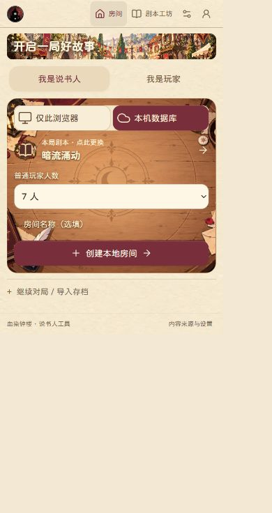
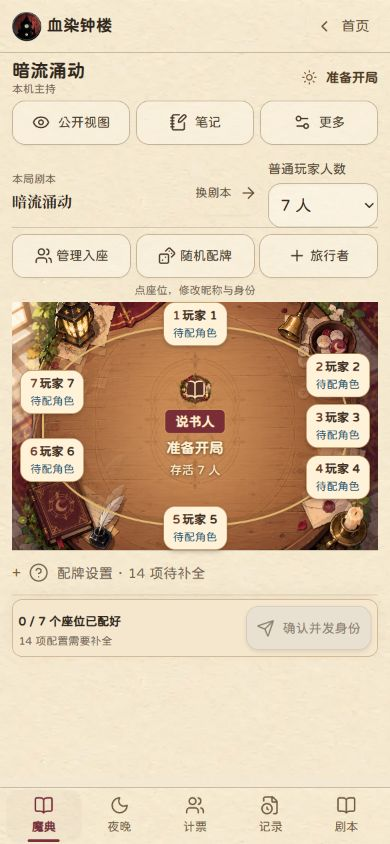
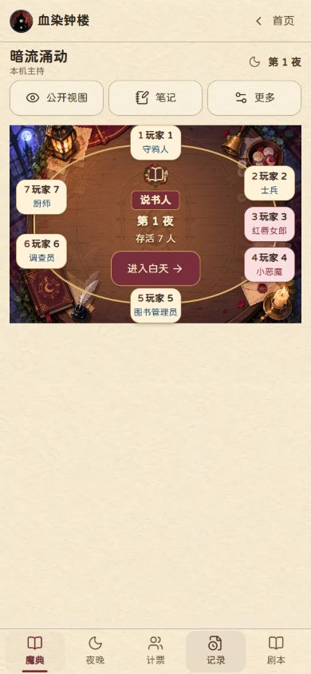
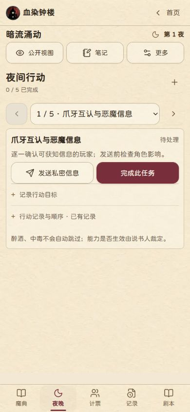
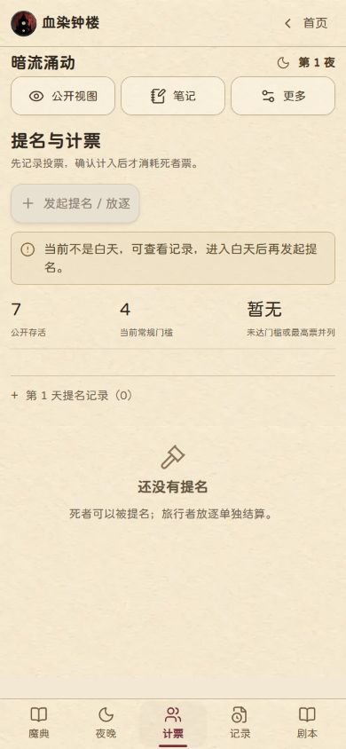
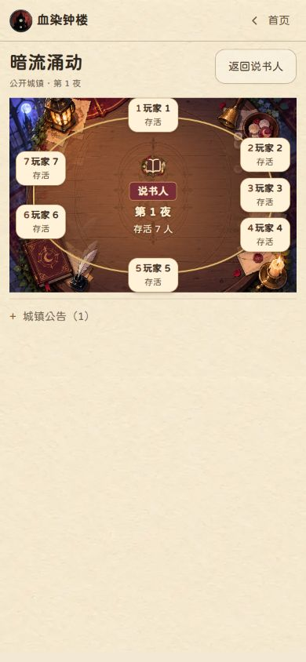
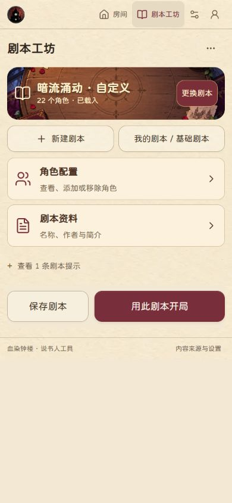
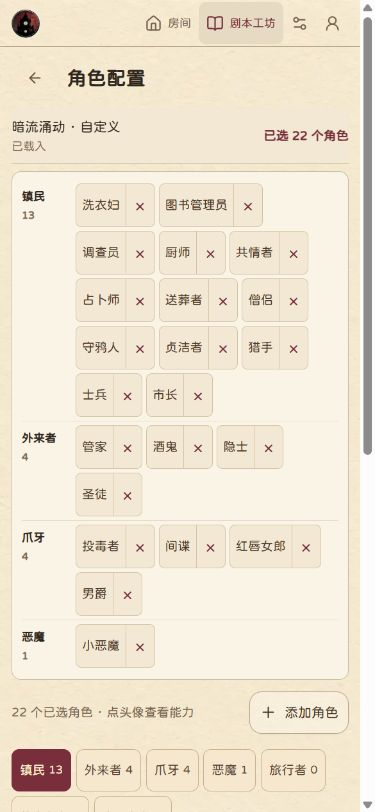

# UI 美术审查与统一生图提示词

审查日期：2026-09-12。当前本地界面，390×844 浏览器视口。只读查看源码并创建一局浏览器本机测试对局；未修改产品 UI、未发布。没有覆盖真实手机、多机同步、满员座位、玩家私密身份页及所有弹窗。

## 当前判断

当前风格为暖羊皮纸、深褐墨色、酒红按钮、柔和手绘木桌。无需重做整套美术。通用操作保留现有 Lucide；状态素材先接入验证，再决定重画；角色图片优先补实际使用且未覆盖的角色。

源码证据：src/lib/art.ts 中 ROLE_ART 覆盖暗流涌动 22 个角色；TEAM_ART、STATUS_ART 已定义，但当前 src 下未见 UI 引用。ability-used 借用传奇类别图片，demon 借用小恶魔图片，loric 借用卷轴，适合补专用符号。手机 compact-mobile 样式主动压缩头像与装饰。

## 检查步骤与截图

1. 首页：主要操作可见；村庄横幅已足够，木纹后的白字局部易受纹理干扰。本机数据库使用云朵图标，建议换网络图标。

2. 准备开局：7 人围桌顺序清楚，主操作可见；保持中央说书人，不增加大头像。

3. 夜间魔典：主操作可达，7 人未见座位重叠；优先补紧凑状态标记，背景四角需要更安静的变体。

4. 夜间行动：结构清楚；待处理、完成、私密发送可用线性符号辅助，纸底应保留。

5. 计票：当前夜晚正确禁用发起提名；数字层级清楚，无需大背景。白天投票流程未实测。

6. 公开城镇：画面未显示角色身份；继续复用同一张桌，只增加公开存活与死者票状态。此结论不等于完整隐私审计。

7. 剧本工坊：操作清楚，已有桌面横幅；补不同剧本的独立徽章比继续堆背景有效。

8. 角色配置：名单紧凑，长页面自然滚动；优先在类别标题加小徽章，已选角色不必逐个增加大图。下方全部角色列表未逐一审查。


## 素材清单

| 优先级 | 素材/位置 | 处理 |
|---|---|---|
| P0 | 死亡、死者票可用/已用、中毒、醉酒、保护 | 优先检查已有素材，接入时保留文字；不同状态须有不同轮廓 |
| P0 | 能力已用、待公布死亡 | 补专用状态符号；不要借用角色或类别图冒充 |
| P1 | 恶魔类别、奇遇类别 | 补独立类别徽章；不沿用小恶魔角色图和普通卷轴作为最终设计 |
| P1 | 暗流涌动、黯月初升、梦殒春宵、自定义 | 四枚专属剧本徽章；可按需扩展同主题封面 |
| P1 | 未覆盖角色 | 按实际剧本角色 ID 逐个补图，先核对名称与主题，禁止用泛职业头像冒充 |
| P2 | 昼夜木桌 | 同构图低干扰版，两张；不是必须重做 |
| P2 | 结算 | 善良/邪恶胜利小徽章即可，无需整屏插画 |

通用返回、关闭、搜索、设置、复制、导入、删除、添加、箭头继续用 Lucide。提名、处决、死亡、放逐不可混用同一符号；保护标记不可暗示所有情况下无敌。秘密标记只给说书人可见。

不增加场景背景的位置：计票表单、夜间任务、记录、笔记、私信、角色能力正文、设置、剧本选角。保持现有浅纸底。

## 软件

已有生图软件即可负责美术母版。若缺少裁切、抠图、调色、导出工具，可选 Photopea：https://www.photopea.com/ 。需要手工整理可缩放图标时再考虑 Inkscape：https://inkscape.org/ 。不用为了本项目另外购买生图、3D 或视频软件。PNG 改扩展名不会变成真正矢量图。

## 完整统一提示词

每次复制下面母提示词，填入资产类型、名称、语义和尺寸；一次生成一个素材。附当前截图以及 public/art/table/table-day.webp、table-night.webp、roles/washerwoman.webp、decoration/parchment-texture.webp 作为风格参考。参考图比纯文字更能限制画风漂移。

```text
你是为手机浏览器桌游工具制作资源的资深游戏美术。为现有《血染钟楼·说书人工具》制作可直接接入的独立美术素材。严格延续我提供的当前 UI 截图和素材参考，保持同一产品的世界观、色板、纸张质感和轮廓语言。

本次资产类型：【状态图标 / 角色徽章 / 类别徽章 / 剧本徽章 / 桌面背景 / 剧本封面】
本次资产名称：【填写】
准确语义与主体：【填写一个明确对象及状态】
输出尺寸与比例：【填写，参照下方规范】

统一风格：温暖而神秘的欧洲古镇桌游，柔和手绘、轻微版画笔触、旧纸纤维、温润木材、少量哑光古铜。轮廓圆润明确，形体简洁，精致但克制；与圆润中文字体和酒红按钮相协调。纸张仅轻微旧化，不能发脏发黄。背景可有细腻材质，小图标必须减少细节。

色板：羊皮纸 #F2E8D3，浅卡纸 #FAF4E7，深褐墨 #30271F，边缘灰棕 #C9BBA2，酒红 #782F3B，参考蓝 #23608B，暗红 #922F40，辅以少量柔和木棕和古铜。禁止高饱和霓虹。不同状态必须以轮廓、符号或填实/镂空区别，不能仅靠颜色。

根据本次资产类型，仅执行对应规范：

A. 状态图标：512×512 透明 PNG，一张一个。主体居中，占画布约 70%，四边保留 15% 安全区，正视、清晰剪影、有限内部细节。不得加圆纸底、厚边框、装饰花环或大阴影。确保缩到 24–32px 仍可辨认。死者票可用与已用使用相同基础票券，分别为完整与明显斜杠注销；死亡与处决使用不同主体；醉酒用倾斜酒杯，中毒用有明显危险符号的药瓶，保护用简洁盾形，能力已用用熄灭火花，待公布死亡用死亡符号配小锁。这些是图形标记，不在图中解释规则。

B. 角色徽章：512×512 透明 PNG，严格参考现有角色徽章：做旧米白圆纸徽章、中心一个与该角色准确对应的器物或象征剪影、少量点缀。圆纸外透明，统一徽章直径与安全边。蓝/红只是遵循提供的美术分组，不生成真实阵营文字；以界面文字判断玩家实际阵营。不要生成人物大头照，不擅自发明角色能力。若未提供角色主体，先要求补充该角色的主题描述。

C. 类别或剧本徽章：512×512 透明 PNG，纸徽章内一个独立且易识别的符号。类别徽章不能照搬某个角色图标。剧本主题可用：暗流涌动＝冒泡坩埚；黯月初升＝月与钟楼；梦殒春宵＝紫罗兰与面具；自定义＝羽毛笔与空白书页。四枚的比例、纸底、明暗、边缘处理完全一致，不生成文字。

D. 桌面背景：先生成 1536×1024、3:2 横向母版，再按目标桌面槽位制作 1536×1536 方形变体。当前手机桌面也是横向区域，不要默认做成竖屏海报。正上方俯视同一张木桌，中央约 70% 保持低对比、均匀、安静的木面，左右座位区域同样减少杂物。书本、羽毛笔、蜡烛、灯笼、布料只少量放在四角，四边有裁切安全区。昼夜两版的物件位置、视角和比例一致，只改变照明与外围环境；夜晚保留足够亮度，不压成黑色。禁止画座位、头像、玩家卡、名字、数字、说书人、按钮、文字或固定人数；这些全部由真实 UI 绘制。中央不要新增高对比法阵。

E. 剧本封面：1536×768、2:1 横向。与对应剧本徽章同主题、同色板，主体偏右，左侧约 60% 低细节以便代码叠加标题。允许窄横幅裁切时仍保持氛围，不绘制标题、文字、卡片框、按钮。

共同排除：写实血腥、恐怖人脸、现代城市、赛博朋克、霓虹、塑料 3D、摄影写实、厚重金属浮雕、繁复花纹、硬光高反差、过度发光、密集星点、无关角色、商标、水印、任何文字与数字、UI 效果图、手机外壳、拼贴、九宫格、精灵图集、把透明棋盘格画进图像。

交付本次指定的一张独立素材，不要一次画整套 UI。透明图保留真实 alpha 通道；不能输出真透明时明确告知。保留高质量 PNG 母版，网页压缩与文字叠加由后续制作完成。生成后自检：是否与参考风格一致、缩小后主体是否清晰、边缘是否完整、背景是否给 UI 留出安静区域。
```

建议第一批实际新生成：能力已用、待公布死亡、恶魔类别、奇遇类别四枚图标，加四枚剧本徽章。现有状态先复用验证；背景与角色扩展按需要再做。所有 24px 小图仍须在真实界面叠加验证，提示词不能替代小尺寸检查。
